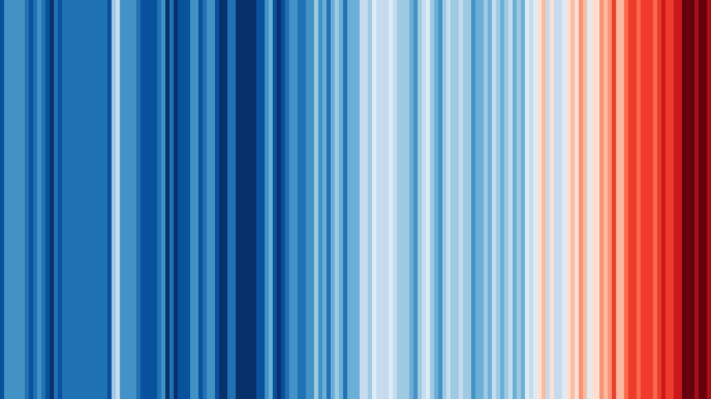
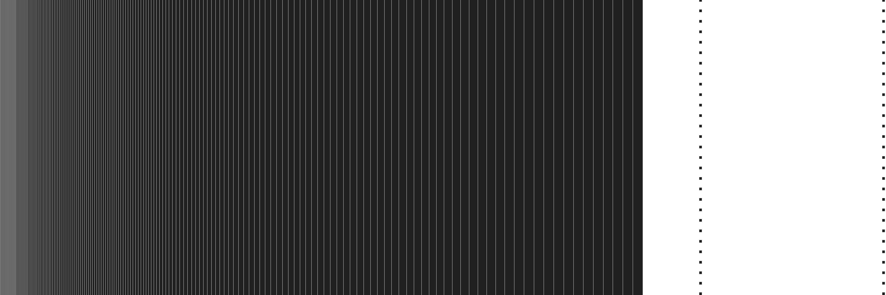

## Some context

 
The carbon stripes was inspired by the warming stripes visualization created by Ed Hawkins (see <a href="https://showyourstripes.info/s/globe" target="_blank" title="https://showyourstripes.info/s/globe">showyourstripes.info</a>). In the warming stripes visualization, each stripe represent a year (from 1850 to 2021) and the stripe's color indicates year's global temperature on earth from blue (cooler) to red (warmer). This is a simple and powerful visualization showing global warming intuitively.

## Carbon stripes

 
The carbon stripes aims at representing yearly CO2 emissions through a simple visualization. The carbon stripes also represent the remaining carbon budget of the 1.5°C and 2°C scenarios.
  
As in the warming stripes, in the carbon stripes each year (from 1850 to 2020) is represented by a stripe. However, in the carbon stripes the width of each stripe depends on the year's CO2 emissions: The more CO2 was emitted, the larger the stripe. Consequently, you can see below that recent years have larger stripes, because world's CO2 emissions are still growing: each year we emit more than previous years.
  
The carbon stripes also represent the remaining CO2 budget of the 1.5°C and the 2°C scenarios. These budgets are represented by two dotted lines, the closer one for the 1.5°C budget and the one on the right edge for the 2°C budget. Otherwise said, to stay below 1.5°C (with 67% chance) all of the stripes from now on to 2100 should fit between the last year's stripe and the closer dotted line. Similarly, to stay below 2°C (with 67% chance) all the stripes from now on to 2100 should fit between the last year's stripe and the dotted line on the right edge. 

Blatantly, carbon stripes of the next years will have to shrink if we are to meet the Paris Agreement. 

## Your own carbon stripes

 
Visualizing the carbon stripes starting from the year of our birth gives a good sense of how fast we could overshoot the Paris Agreement if emissions do not decrease. The app below allows you to create your own carbon stripes by starting the stripes from the year of your choice (between 1850 and 2019). You can see that with current amounts of yearly CO2 emissions, we would overshoot the 1.5°C budget in less than 10 years and the 2°C budget before 2050. 
 
<iframe height="460px" width = "100%" frameborder="no" src="https://yoannjulliard.shinyapps.io/carbon_stripes_app/"> </iframe>

## About the carbon stripes

 
The carbon stripes visualization was generated using R and the ggplot2 library. The app was created using the shiny library, click <a href="https://yoannjulliard.shinyapps.io/carbon_stripes_app/" target="_blank" title="https://yoannjulliard.shinyapps.io/carbon_stripes_app/">here</a> to open the shiny app in a stand-alone web page. Data for historical CO2 emissions were gathered from Our World In Data (see <a href="https://ourworldindata.org/co2-emissions" target="_blank" title="https://ourworldindata.org/co2-emissions">ourworldindata.org/co2-emissions</a>). Data for the remaining CO2 budget of the 1.5°C and 2°C scenarios were gathered from the IPCC AR6 report of Group 1 (see <a href="https://www.ipcc.ch/report/ar6/wg1/" target="_blank" title="https://www.ipcc.ch/report/ar6/wg1/">IPCC AR6 WG1 report</a>). 
  
This work is under a CC-BY-SA license, do not hesitate to download and share the carbon stripes, especially the one starting from the year of your birth.
  
Feedback on the post is appreciated, do not hesitate to reach me via <a href="/#contact" target="_blank" title="/#contact">email</a> or <a href="https://twitter.com/YoannJulliard" target="_blank" title="https://twitter.com/YoannJulliard">Twitter</a>. 

