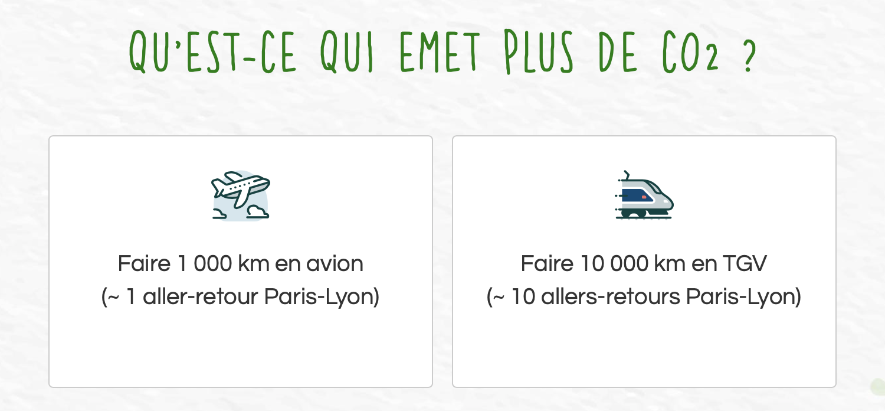
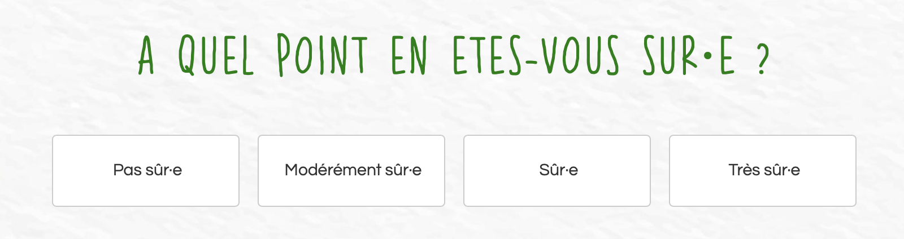
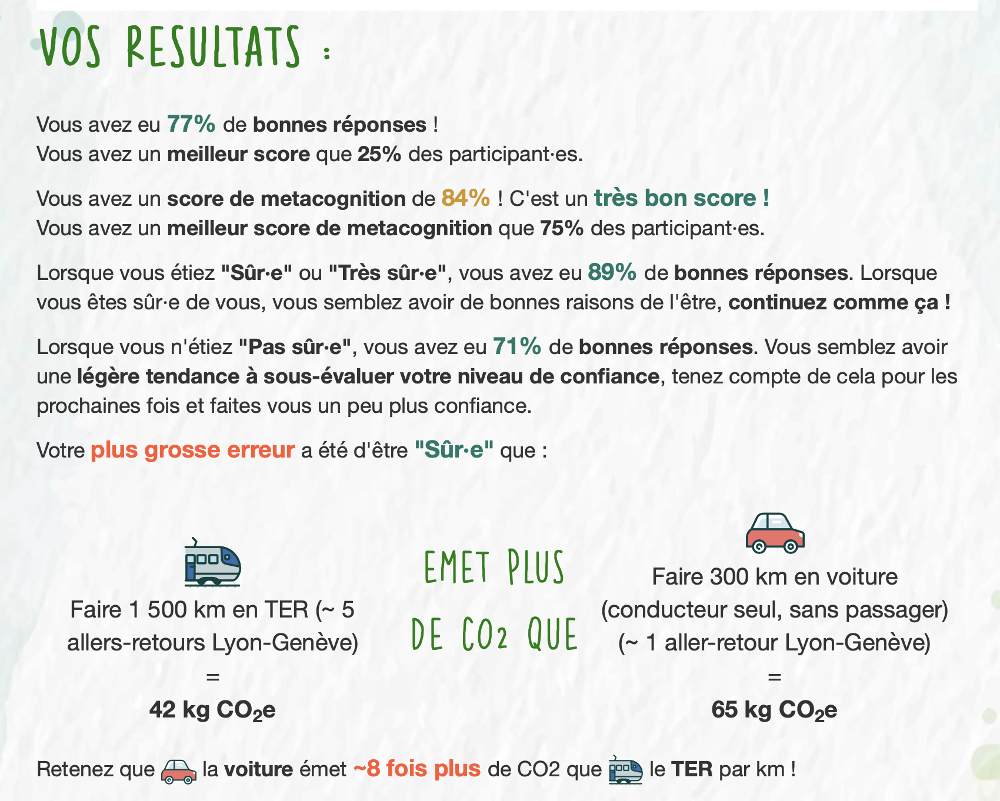

## Participate!

 
Before reading this post, <b>participate in META-CO2!</b> The experiment takes less than <b>5 minutes</b>. 

Actually, taking part in the experiment is the best way to learn about the META-CO2 project.

The experiment is <b>only available in French</b> and you have to run it <b>on a computer</b> (smartphone compatibility is not ready yet).

<b>To take part in META-CO2</b>, follow this link: <a href="https://m-co2.netlify.app" target="_blank" title="m-co2.netlify.app" style='font-size: 18px'>m-co2.netlify.app</a>
 
Note that your data will be anonymized and may be used for research purposes.

Once you completed the experiment, you will be provided feedback on your CO2 knowledge and metacognition. We will also give you a bunch of personalized feedbacks and some resources on CO2 emissions.

## Some context

 
Climate change is a clear threat for humanity and biodiversity. Human-related activities emit around 40 billion tons of CO2 per year (more precisely of CO2 equivalent: each greenhouse gas is accounted for and converted to a CO2 equivalent). These emissions have to shrink in the coming years if we are to meet the Paris agreement (see my <a href="https://yoannjulliard.netlify.app/post/carbon-stripes" target="_blank" title="yoannjulliard.netlify.app/post/carbon-stripes">carbon stripes post</a> to know more).

 
To diminish our carbon footprint, we have to know to what extent various activities emit. For instance, we have to know whether an electric car emit less or more than a traditional car. Before taking a decision (switching to an electric car for example) it is important to be sure that this decision will reduce our carbon footprint and being right to be sure about that. 
 Indeed, if one is not sure he or she will not commit in the new behavior and if one is sure but wrong he or she will commit in a new behavior that is even worse.

 
Otherwise said, people should have both a good CO2 knowledge and a good CO2 metacognition.

 
META-CO2 aims at evaluating both CO2 knowledge and CO2 metacognition. This project was born in 2023 in collaboration with Lise Brun. Lise worked on motor metacognition and we shared a common interest in climate change and carbon footprint. We thought that CO2 metacognition was important for behavioral change and therefore launched the META-CO2 project. 

 
To date, we conducted two experiments with help of Laure Rapp that was doing an internship with us on this project. The experiment running currently is the third of this kind, and the first being publicly available.

## The experiment

 
As I mentioned above, META-CO2 aims at evaluating both CO2 knowledge and metacognition. 

 
In the experiment, participants are presented with two behaviors at a time and asked 'which emits the most CO2?'. For instance, we could ask which emits the most CO2 between travelling '1 000 km by plane' or '10 000 km by train'. 
 See the example in french below:

Once they chose, they are asked 'to what extent are you sure' and they can answer 'Not sure', 'Moderately sure', 'Sure', or 'Very sure'. 
 See the example in french below:

After a bunch of trials with diverse behaviors, we are able to calculate their accuracy and metacognition score, how they compare with other participants, to draw a plot summarizing their performance, and to provide various personalized feedbacks.
 See an example in french below: 

 
For now, the currently running experiment is only concerned with the transport sector. In future versions, we plan to add more sectors so that participants can choose the one(s) they want to test.

## The metacognitive score

 
At the end of the experiment, we provide each participant with his or her 'metacognitive score'. We made up this score as an intuitive way to gauge their metacognitive performance. A metacognitive score of 50% means that one's certainty-to-accuracy calibration is no better than chance. On the other hand, a metacognitive score of 100% means that a person's certainty is totally in line with his or her accuracy.

 
We provide below a more rigorous explanation of the 'metacognitive score':

 
To model participants' metacognition, we use a logistic regression: its the same as a regular regression <math display="inline" style='font-size: 17px'><mrow><mi>y</mi><mo>=</mo><mi>a</mi><mi>x</mi><mo>+</mo><mi>b</mi></mrow></math>, but the variable that is modeled (<math display="inline" style='font-size: 17px'><mrow><mi>y</mi></mrow></math>) is binary (0 or 1) instead of continuous. Therefore, a logit link is applied to this variable to be able to perform the regression. This means that we do not manipulate the raw variable (0 or 1) anymore but the log of the odds (also called the logit) of this variable. This is where complications begin.

 
Actually, the metacognitive performance corresponds the slope of the logistic regression (<math display="inline" style='font-size: 17px'><mrow><mi>a</mi></mrow></math> in <math display="inline" style='font-size: 17px'><mrow><mi>y</mi><mo>=</mo><mi>a</mi><mi>x</mi><mo>+</mo><mi>b</mi></mrow></math>). However, because of the logit link this slope should be interpreted as: when I do one step on the certainty scale (for instance, moving from 'moderately sure' to 'sure') how much the log of odds of being correct evolve? This is quite unintelligible because we do not have an intuitive sense of the log of the odds.

 
To convert this interpretation into something more intelligible, we apply transformations to the slope. Basically, we take the slope (in logit) in the middle of the certainty scale (between 'moderately sure' and 'sure') and convert this slope into probabilities by applying the formula: <math display="inline" style='font-size: 17px'><mrow><mi>logit</mi><mo>·</mo><mi>p</mi><mo>(</mo><mn>1</mn><mo>-</mo><mi>p</mi><mo>)</mo></mrow></math>, with <math display="inline" style='font-size: 17px'><mrow><mi>p</mi></mrow></math> being the probability of giving a correct response at the middle of the certainty scale (between 'moderately sure' and 'sure'). Once this conversion is done, we have a 'probability slope'. 

 
Then, we convert this new 'probability slope' into a percentage of the 'perfect slope' (the slope that someone calibrating perfectly his or her certainty to his or her accuracy would have: 0.1667). 
 Finally, we rescale this percentage (ranging from 0% to 100%) to a 50% to 100% range by dividing this percentage by 2 and adding 50, the full formula being: <math display="block" style='font-size: 17px'><mo>(</mo><mn>100</mn><mo>-</mo><mn>50</mn><mo>)</mo><mo>·</mo><mfrac><mrow><mfrac><mrow><mi>slope</mi></mrow><mrow><mn>0.1667</mn></mrow></mfrac><mrow><mo>·</mo><mn>100</mn></mrow></mrow><mrow><mn>100</mn></mrow></mfrac><mrow> <mo>+</mo><mn>50</mn></mrow><mrow><mo>&iff;</mo></mrow><mfrac><mrow><mfrac><mrow><mi>slope</mi></mrow><mrow><mn>0.1667</mn></mrow></mfrac><mrow><mo>·</mo><mn>100</mn></mrow></mrow><mrow><mn>2</mn></mrow></mfrac><mrow> <mo>+</mo><mn>50</mn></mrow></math>
 I decided to rescale the score to a 50% to 100% scale because I think it is more intuitive to think of a 50% score as being no better than chance. Actually, that is the way we think of a 50% accuracy score in a two-choice questionnaire: being no better than chance.

 
Therefore, the metacognitive score can be thought of the same way that we intuitively think of a two-choice questionnaire score: 50% is bad and 100% is perfect.

## Under the hood

 
The META-CO2 experiment can be divided into three parts : the experiment, the database and the feedbacks.

 
The experiment is programmed using <a href="https://www.jspsych.org/" target="_blank" title="jspsych.org/">jsPsych</a>, a JavaScript library made for psychology experiments. The code is hosted on <a href="https://github.com" target="_blank" title="github.com">github</a> and the website deployed with <a href="https://www.netlify.com" target="_blank" title="netlify.com">netlify</a>. The stimuli displayed in the experiment are created with <a href="https://www.r-project.org" target="_blank" title="r-project.org">R</a> with data coming from <a href="https://impactco2.fr" target="_blank" title="impactco2.fr">impactco2.fr</a>.

 
The database is hosted with the <a href="https://firebase.google.com" target="_blank" title="firebase.google.com">firebase</a> google service. I use a realtime database that logs data as participants go along in the experiment, meaning that at the end of the experiment the data are ready to be accessed.

 
The feedbacks are provided using the <a href="https://shiny.posit.co" target="_blank" title="shiny.posit.co">R shiny</a> library, hosted on posit (previously RStudio) servers. All of the data preprocessing and data analysis is made with <a href="https://www.r-project.org" target="_blank" title="r-project.org">R</a> and the <a href="https://www.tidyverse.org" target="_blank" title="tidyverse.org">tidyverse</a> library. The plot is made with the <a href="https://ggplot2.tidyverse.org" target="_blank" title="ggplot2.tidyverse.org">ggplot2</a> library. Personalized data are accessed thanks to an anonymized unique id that is created at the beginning of the experiment and provided to the shiny app through the redirection link.

 
Feedback on the post or the experiment is appreciated, do not hesitate to reach me via <a href="/#contact" target="_blank" title="/#contact">email</a> or <a href="https://fediscience.org/@YoannJulliard" target="_blank" title="fediscience.org/@YoannJulliard">Mastodon</a>. 

